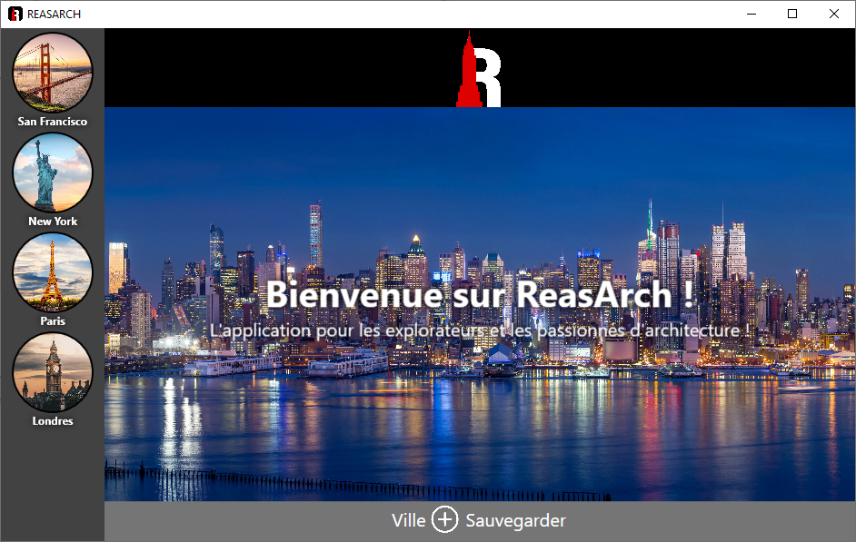
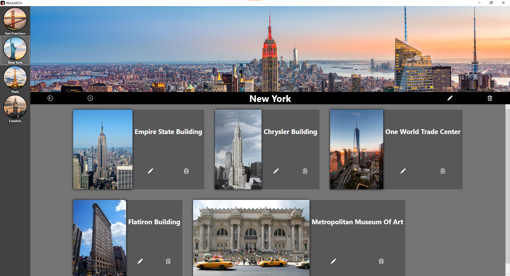
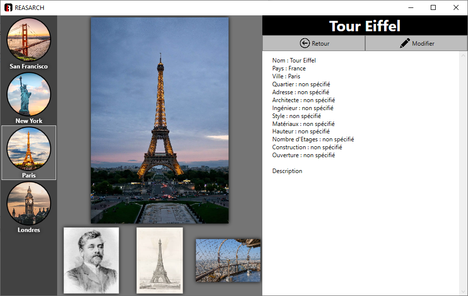
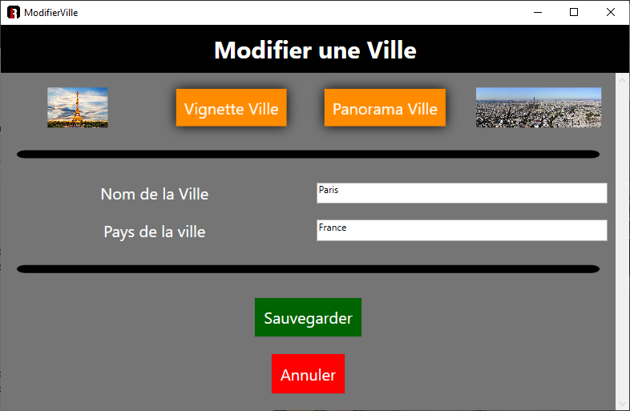

# ReasArch
ReasArch is a very powerfull for people who explore daily new horizons.

### Description (french)

Bonjour ! Aujourd’hui nous vous présentons notre nouvelle application disponible sur
Windows, intitulée « ReasArch ». ReasArch est destinée aux personnes qui explorent
quotidiennement de nouveaux horizons comme les voyageurs, les artistes en tout genre
mais également les passionnés d’architecture et les architectes eux-mêmes. L’interface
regroupe une sélection de villes du monde entier et des bâtiments se situant dans celles-ci.
Toutes ces merveilles d’architecture sont connues (pour la plupart) de la population par des
photos ou des visites, cependant presque personne, à l’exception des architectes, n’en
connait les secrets ou les spécificités. L’objectif est donc de proposer, pour tous ces types
d’utilisateurs, une description riche et inédite de ces édifices architecturaux singuliers,
agrémentée de vues de conception venant tout droit des agences d’architecture, des photos
de constructions, de photos dans le temps ou encore des plans détaillés de l’agencement et
de la structure. Cette application possède également une forte dimension touristique qui
répond à nombre de demandes et d’attentes, jugez par vous-même.

### Description (english)

Hello ! Today we present our new application available on
Windows, titled "ReasArch". ReasArch is intended for people who explore new horizons on a daily basis, such as travelers, 
artists of all kinds, but also architecture enthusiasts and architects themselves. The interface brings together a selection 
of cities from around the world and the buildings located in them.
All these architectural marvels are known (for the most part) to the population through photos or tours, yet hardly anyone, 
except architects, knows their secrets or specifics. The objective is therefore to offer, for all these types of users, a rich 
and unprecedented description of these singular architectural buildings, embellished with design views coming straight from architectural 
agencies, photos of constructions, photos in the field. time or detailed plans of the layout and structure. This application also has a strong 
tourist dimension which meets a number of requests and expectations, see for yourself.

### Doc

You will find all the documentation of this project in the **documentation** folder.

### Visuals

**Home page :**

**City page :**

**Buildings page :**

**Modify page :**

